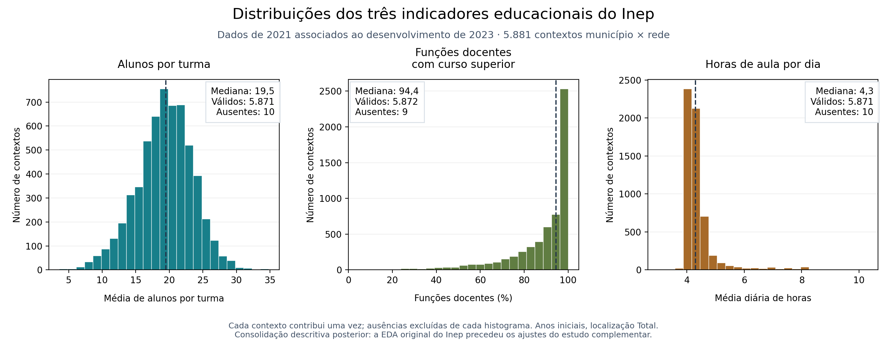
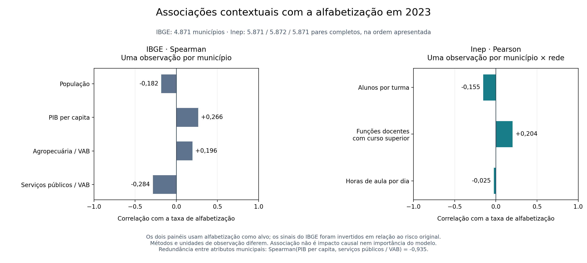
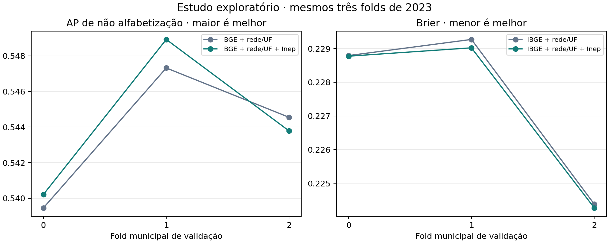
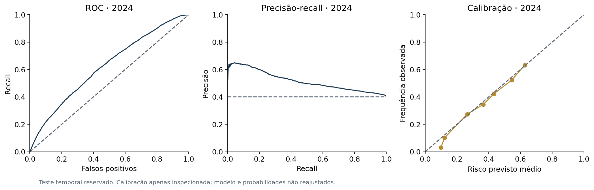
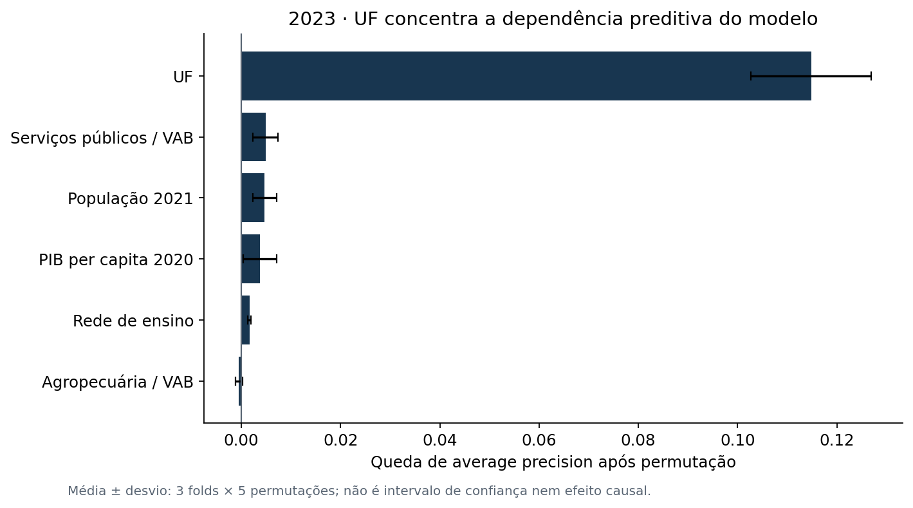

# Predição e inteligência analítica para alfabetização no Brasil

**Autor: André Mohallem Ferraz · FIAP, Tech Challenge Fase 3 · Trabalho individual · Entrega: 15/09/2026**

Entrega 1.3 de 13/09/2026. Modelo de referência 1.0, limiar e avaliação temporal concluídos. O modelo supera
uma referência constante, mas seu poder de discriminação é moderado e o limiar de F2
sinaliza quase toda a população. A aplicação proposta é apoio exploratório ao planejamento
territorial, com validação local antes de qualquer uso operacional.

- [Relatório técnico completo](docs/Relatorio-Tecnico-Fase3.md), versão 1.3 em [PDF](https://github.com/andreferraz-fiap-fase2/tech-challenge-fase3/releases/download/v1.3-entrega/Relatorio-Tecnico-Fase3-v1.3.pdf) e [Word](https://github.com/andreferraz-fiap-fase2/tech-challenge-fase3/releases/download/v1.3-entrega/Relatorio-Tecnico-Fase3-v1.3.docx).
- [Roteiro executivo atualizado](docs/Roteiro-Video-Fase3.md) e [vídeo existente 1.2](https://github.com/andreferraz-fiap-fase2/tech-challenge-fase3/releases/download/v1.2-entrega/Video-Executivo-Fase3-v1.2.mp4), preservado.
- [Arquivos finais 1.3: PDF, Word, apresentação e roteiro](https://github.com/andreferraz-fiap-fase2/tech-challenge-fase3/releases/tag/v1.3-entrega).
- [Análise exploratória dos dados enriquecidos](#4-análise-exploratória-e-entendimento-do-problema), com distribuições, cobertura, associações e hipóteses.
- [Demonstração da probabilidade](docs/Demonstracao-Previsao.md) e [protocolo do estudo educacional complementar](docs/Protocolo-Estudo-Educacional.md).
- [Protocolo antes do teste](reports/protocolo-final.md), [resultado temporal](reports/teste_temporal_2024.json) e [reprodução completa](reports/reproducibilidade_completa.json).

## 1. Contexto do problema

A Fase 2 construiu a engenharia de dados do Indicador Criança Alfabetizada (ICA), dos
territórios e das metas. Sua Gold municipal reúne indicadores agregados e não preserva
o desfecho de cada aluno necessário à classificação individual. Esta entrega reconstrói
uma **Gold por aluno/ano** a partir da Silver e das fontes originais auditadas daquela
pipeline, aplica os filtros de elegibilidade e acrescenta o contexto do IBGE. A Gold
municipal original participa da análise posterior de metas. Essa adaptação de grão
preserva a entrega anterior e explicita a origem dos dados usados no treinamento.

O critério observado é **proficiência maior ou igual a 743 pontos = alfabetizado**;
proficiência válida abaixo de 743 = não alfabetizado. A própria nota define o rótulo
e, portanto, fica fora dos preditores. Ausência na prova ou nota inválida não equivale
a não alfabetização e leva à exclusão do registro desta população de estudo.
[Referência: Inep, Avaliação da Alfabetização](https://www.gov.br/inep/pt-br/areas-de-atuacao/avaliacao-e-exames-educacionais/avaliacao-da-alfabetizacao).

## 2. Objetivo analítico

**Pergunta principal:** qual é a probabilidade estimada de um aluno avaliado do 2º ano
da rede Estadual ou Municipal ser considerado alfabetizado pelo critério de proficiência
maior ou igual a 743 pontos, considerando sua rede de ensino e o contexto territorial
e socioeconômico do município?

O modelo estima `P(alfabetizado)`. A classe de interesse na avaliação é não alfabetizado:
`p_risco = 1 - P(alfabetizado)`. A classificação binária solicitada pelo desafio é obtida
aplicando um limiar a essa probabilidade. **O corte de 743 pontos define o alvo observado;
o limiar de probabilidade define a decisão do modelo.** São critérios distintos.

Na referência de 0,5, `p_risco >= 0,5` resulta em previsão de não alfabetizado; abaixo
disso, alfabetizado. A política F2 congelada sinaliza risco a partir de
`p_risco >= 0,15016323973380263`, priorizando a identificação de não alfabetizados.
Esse limiar tem baixa seletividade e não representa um novo padrão de alfabetização.
As duas decisões usam as mesmas probabilidades, sem modificar o critério observado.

**Pergunta complementar:** quais variáveis mais contribuem para as estimativas produzidas
pelo modelo? A importância por permutação descreve contribuição preditiva, sem estabelecer
que alterar uma variável causará melhora na alfabetização.

A chave é `(ano, id_aluno)`; os identificadores não permitem acompanhar a mesma criança
entre anos. Os atributos são contextuais: alunos com os mesmos atributos recebem a mesma
probabilidade. A ampliação com indicadores educacionais do Inep é examinada em estudo
complementar de 2023, separado do modelo final 1.0 e de seu teste temporal já observado.
[Pergunta, critérios e linhagem da Gold](docs/Pergunta-e-Linhagem.md).

## 3. Base utilizada

| Recorte auditado | 2023: desenvolvimento | 2024: teste temporal |
| --- | ---: | ---: |
| Avaliações reais elegíveis | 1.502.809 | 1.851.828 |
| Municípios | 4.871 | 5.517 |
| UFs presentes no recorte | 23 | 26 |
| Eventos sintéticos excluídos da Silver | 1.518 | 1.482 |

Foram excluídos os 3.000 eventos simulados de streaming, ausentes, avaliações sem
proficiência/rótulo válido e redes fora do escopo. Total elegível: **3.354.637 avaliações**.
Os dez campos de origem auditados da Silver batch foram confrontados com os originais.
As primeiras estimativas dos documentos de planejamento 01/02 foram corrigidas na definição
analítica 03 e na construção da Gold. A contagem acima é a versão válida da entrega.

**Enriquecimento com bases externas do IBGE.** A base de alunos da Fase 2 foi cruzada
com duas bases públicas do Instituto Brasileiro de Geografia e Estatística (IBGE):

| Base externa e arquivo de origem | Ano de referência | Atributos acrescentados ao modelo |
| --- | --- | --- |
| [IBGE — Estimativas da População, publicação no DOU](https://ftp.ibge.gov.br/Estimativas_de_Populacao/Estimativas_2021/estimativa_dou_2021.ods) | 2021 | População do município |
| [IBGE — Produto Interno Bruto dos Municípios, edição 2020](https://ftp.ibge.gov.br/Pib_Municipios/2020/base/base_de_dados_2010_2020_txt.zip) | 2020, selecionado no arquivo da série 2010–2020 | PIB per capita; participação da agropecuária no VAB; participação dos serviços públicos no VAB |

O cruzamento usa o **código IBGE do município (`id_municipio`)**, com cobertura de 100%
dos municípios elegíveis de 2023 e 2024. As participações econômicas são calculadas como
percentual do valor adicionado bruto (VAB) total. O enriquecimento é municipal: cada aluno
recebe o contexto de seu município.

São **quatro atributos externos do IBGE**, somados à **rede de ensino e à UF da Fase 2**,
totalizando os seis preditores. As edições externas foram publicadas até 31/12/2022 e
são mantidas iguais nos dois ciclos. PIB per capita não é renda familiar; VAB de serviços
públicos não é gasto em educação. URLs, datas de publicação e hashes dos arquivos estão
no [manifesto das fontes externas](config/fontes-externas.json).

Metas, indicadores contemporâneos, proficiência, rótulos, IDs e peso ficam fora de X.
A Gold municipal da Fase 2 entra somente na leitura posterior das metas, sem orientar o modelo.
[Contrato](config/contrato-ml-aluno.json) · [Dicionário](config/dicionario-variaveis.csv) ·
[Snapshot de oito arquivos](config/snapshot.json) · [Preparação das entradas](data/README.md).

**Expansão educacional complementar — Inep.** Três bases municipais de 2021 acrescentam
média de alunos por turma, percentual de docentes com curso superior e média de horas
de aula, para os anos iniciais. As páginas das edições foram publicadas em 31/01/2022.
A junção por município e rede Estadual/Municipal usa a localização Total e mantém os
1.502.809 alunos de 2023. A cobertura é 99,9858% para turmas/horas e 99,9885% para docentes.
Restam 213, 213 e 173 alunos com ausência, respectivamente, tratada dentro dos folds.
O modelo de referência conserva seus seis atributos; os nove atributos pertencem ao
estudo complementar. [Fontes e definições](docs/Fontes-Educacionais.md) ·
[Manifesto educacional](config/fontes-educacionais.json).

## 4. Análise exploratória e entendimento do problema

A análise exploratória apresenta **quem está representado, como os atributos variam,
onde faltam informações e quais associações ajudam a formular hipóteses**. Toda a EDA
desta seção utiliza o desenvolvimento de 2023. O teste de 2024 não participa da exploração
dos atributos nem da consolidação apresentada aqui.

### 4.1. População, unidades de análise e cronologia

São **1.502.809 avaliações reais elegíveis**, em **4.871 municípios** e **5.881 contextos
município × rede**. O enriquecimento passa de seis para nove atributos, preservando
os mesmos alunos e folds. Não acrescenta observações nem informações individuais
da turma, do professor ou da família de cada criança.

| O que é examinado | Unidade de análise | Interpretação |
| --- | --- | --- |
| Distribuição do alvo e diferenças por região, UF ou rede | Uma avaliação por aluno/ano | Frequências e taxas no recorte elegível, sem pressupor representatividade nacional. |
| População, PIB e composição econômica do IBGE | Uma observação por município: 4.871 | Cada município tem o mesmo peso nas distribuições e correlações contextuais. |
| Turmas, funções docentes e jornada do Inep | Uma observação por município × rede: 5.881 | As redes Estadual e Municipal são contextos distintos dentro de um município. |
| Cobertura do enriquecimento para a modelagem | Uma avaliação por aluno/ano: 1.502.809 | Quantifica quantos alunos recebem cada atributo antes da imputação. |

O alvo observado é alfabetizado quando a proficiência válida é **maior ou igual a 743**.
Há 877.427 alfabetizados e **625.382 não alfabetizados, ou 41,61%**, sem ponderação.
A classe de risco tem volume expressivo; a EDA não indicou necessidade inicial de gerar
exemplos artificiais. Nas taxas regionais de não alfabetização, Norte apresenta **48,89%**
e Sul, **32,27%**. Esse contraste e a repetição dos perfis motivam validação por município
e leitura dos erros por território; não constituem causas comprovadas dos resultados.


**Cronologia das evidências.** A EDA inicial precedeu os modelos; as correlações do IBGE
vieram na interpretação posterior. No estudo Inep, protocolo e EDA antecederam os novos
ajustes. Esta seção, seus gráficos e a tabela de hipóteses consolidam as evidências
**após os experimentos**; não são um registro prospectivo de todas as decisões.

[EDA inicial](reports/eda_development.md) · [Distribuição do alvo](images/01_alvo_2023.png) ·
[Regiões](reports/eda_regiao_2023.csv) · [UFs](reports/eda_sigla_uf_2023.csv) ·
[Redes](reports/eda_rede_nome_2023.csv) · [EDA educacional anterior ao ajuste](reports/estudo_educacional_eda_2023.json).

### 4.2. Distribuições e cobertura dos atributos enriquecidos

Os atributos externos descrevem tamanho do município, economia local e condições
agregadas da oferta educacional. As medianas usam as unidades contextuais, sem repetir
cada indicador pelo número de alunos.

| Atributo histórico | Mediana em 2023 | Contextos válidos / total | Unidade contextual |
| --- | ---: | ---: | --- |
| População 2021 | 11.563 habitantes | 4.871 / 4.871 | Município |
| PIB per capita 2020 | R$ 18.256,44 | 4.871 / 4.871 | Município |
| Participação da agropecuária no VAB 2020 | 17,23% | 4.871 / 4.871 | Município |
| Participação dos serviços públicos no VAB 2020 | 31,62% | 4.871 / 4.871 | Município |
| Alunos por turma nos anos iniciais 2021 | **19,5 alunos** | 5.871 / 5.881 | Município × rede |
| Funções docentes com curso superior nos anos iniciais 2021 | **94,4%** | 5.872 / 5.881 | Município × rede |
| Horas-aula diárias nos anos iniciais 2021 | **4,3 horas** | 5.871 / 5.881 | Município × rede |

A população média de **33.245,10 habitantes** supera a mediana de 11.563; no PIB per
capita, a média de **R$ 26.098,86** supera a mediana de R$ 18.256,44. As caudas à direita
e escalas diferentes fundamentam `log1p` em população/PIB e padronização na logística.
O boosting utiliza os numéricos sem log ou padronização. A escala log10 dos
[histogramas econômicos](images/03_contexto_municipal_2023.png) serve apenas à visualização.

Os intervalos educacionais são **3,6–34,8 alunos por turma**, **4,7–100% de funções docentes
com superior** e **3–10,3 horas-aula diárias**. A formação concentra-se próxima de 100%;
a jornada, perto de quatro horas, com alguns valores maiores. Esses indicadores de 2021
não comprovam exposição individual, presença efetiva ou qualidade pedagógica.



| Indicador do Inep | Contextos sem indicador | Alunos sem indicador | Cobertura por aluno |
| --- | ---: | ---: | ---: |
| Alunos por turma | 10 | 213 | 99,9858% |
| Funções docentes com superior | 9 | 173 | 99,9885% |
| Horas-aula diárias | 10 | 213 | 99,9858% |

Os quatro atributos do IBGE estão completos. No Inep, `--` e células vazias são ausências,
não zeros. A cobertura supera o requisito de 95% do protocolo; nenhum aluno é descartado.
A mediana é aprendida nos dois folds de treinamento e reaplicada à validação.

[Síntese da EDA enriquecida](reports/eda_enriquecida_2023.md) ·
[Distribuições do IBGE](reports/eda_numericas_municipios_2023.csv) ·
[Distribuições do Inep](reports/estudo_educacional_distribuicoes_2023.csv) ·
[Cobertura por aluno e contexto](reports/estudo_educacional_cobertura_2023.csv) ·
[Definições das fontes educacionais](docs/Fontes-Educacionais.md).

### 4.3. Associações contextuais e limites de interpretação

O gráfico apresenta associações com a **taxa observada de alfabetização de 2023**.
Os painéis têm unidades e métodos distintos: Spearman entre municípios no IBGE;
Pearson entre contextos município × rede no Inep. Os coeficientes não devem ser
comparados como se medissem importância preditiva pelo mesmo procedimento.



Nas correlações do Inep, a taxa de alfabetização tem associação linear **−0,1545**
com alunos por turma, **+0,2041** com funções docentes com superior e **−0,02477**
com horas-aula. Cada cálculo usa somente os pares completos: 5.871, 5.872 e 5.871,
respectivamente. A associação marginal da jornada é próxima de zero; isso não
demonstra que jornada seja irrelevante, nem autoriza interpretar os outros sinais
como efeitos de uma intervenção.

Na orientação original do relatório do IBGE, Spearman com a taxa municipal de
**não alfabetização** é **+0,182** para população, **−0,266** para PIB per capita,
**−0,196** para agropecuária e **+0,284** para serviços públicos, em 4.871 municípios.
O painel acima inverte esses sinais para apresentar alfabetização, mantendo os mesmos
pares e coeficientes em módulo. As associações do IBGE foram calculadas após a modelagem
original e não justificam retrospectivamente a seleção inicial de atributos ou modelos.

PIB per capita e participação dos serviços públicos no VAB também apresentam forte
associação inversa entre si: **Spearman −0,9349**. Essa dependência indica possível
redundância de informação e limita a atribuição de contribuições isoladas. PIB não é
renda familiar; participação dos serviços públicos não é gasto em educação. Nenhum
atributo foi removido ou modelo reajustado em decorrência desta leitura.

Correlações não demonstram causalidade e podem refletir outras características dos
territórios. Tampouco permitem concluir que um aluno individual seguirá o padrão médio
do município ou da rede. A contribuição preditiva é examinada na comparação dos modelos
e na importância por permutação, mantendo essas perguntas separadas.

[Correlações originais do IBGE](reports/correlacoes_municipais_2023.csv) ·
[Correlações do Inep](reports/estudo_educacional_correlacoes_2023.csv) ·
[Consolidação e unidades de análise](reports/eda_enriquecida_2023_correlacoes.csv).

### 4.4. Das evidências às hipóteses e decisões

A tabela reúne evidências, justificativas e resultados já observados. **É uma síntese
editorial posterior**, com a cronologia identificada na seção 4.1. O protocolo específico
da comparação educacional foi registrado previamente no commit `038bdcd`.

| Evidência no desenvolvimento de 2023 | Hipótese ou justificativa | Decisão e resultado verificável |
| --- | --- | --- |
| Os quatro atributos do IBGE variam entre municípios. | H1: o contexto numérico pode acrescentar informação além de rede e UF. | Comparar variantes rede/UF e completa nos mesmos três folds e alunos; a logística ganhou +0,004819 de AP média. |
| População e PIB per capita têm médias acima das medianas e escalas diferentes. | Caudas à direita e escalas justificam transformar os dados no modelo linear. | Aplicar log1p em população/PIB e padronizar os quatro numéricos na logística; boosting sem log ou padronização. |
| Há 625.382 não alfabetizados, ou 41,61%. | A classe de interesse tem volume expressivo; não há justificativa inicial para gerar exemplos artificiais. | Baseline de prevalência e AP da classe de risco; comparar modelos sem reamostragem ou ponderação de classes. |
| Norte tem 48,89% de não alfabetização e Sul, 32,27%; há 5.881 perfis em 1.502.809 avaliações. | Heterogeneidade territorial e contextos repetidos limitam a independência entre alunos. | Folds por município, distribuições econômicas com uma linha por município e avaliação por região e municípios novos. |
| Os quatro numéricos originais não têm ausências; os três do Inep deixam de cobrir 173–213 alunos cada. | A imputação precisa estar definida, com tratamento distinto entre cobertura original completa e expansão incompleta. | Mediana aprendida somente no treino. A Gold original exige contexto completo; o estudo preserva as ausências residuais até cada fold. |
| Os três indicadores do Inep variam entre redes/municípios e têm cobertura superior a 99,98%. | H2: condições educacionais podem acrescentar informação ao contexto IBGE, rede e UF. | Comparar seis e nove atributos com mesmos folds e hiperparâmetros; ganho exploratório de AP +0,000531, positivo em dois folds e negativo em um. |
| A associação marginal de horas-aula com alfabetização é próxima de zero; PIB e serviços públicos são fortemente associados. | Uma correlação isolada não estabelece utilidade multivariada, efeito causal ou contribuição independente. | Manter os conjuntos de atributos registrados; interpretar comparações e permutação com cautela, sem nova seleção a partir da consolidação. |

O comparativo da logística deu suporte descritivo a H1: AP média de **0,533285** com
rede/UF e **0,538103** com os seis atributos, diferença **+0,004819**, positiva nos três
folds. H2 recebeu suporte preditivo pequeno e inconsistente entre folds, detalhado na
seção 5.2. Esses resultados não demonstram causalidade nem significância estatística.
Também não foi realizado um experimento isolando o efeito do log1p, da padronização ou
da reamostragem; essas escolhas não são apresentadas como causas comprovadas de melhora.

[Ganho do IBGE por fold](reports/logistica_delta_enriquecimento_2023.csv) ·
[Protocolo educacional](docs/Protocolo-Estudo-Educacional.md) ·
[Diferenças com o Inep por fold](reports/estudo_educacional_deltas_2023.csv).

## 5. Etapas de modelagem

### 5.1. Pipeline integrada e controles de validação

Três folds fixos separam municípios inteiros: 500.934, 500.942 e 500.933 alunos.
O mapa de folds foi definido antes da modelagem, sem consultar rótulos. Em cada rodada,
dois folds treinam e o terceiro valida. Os municípios de validação não aparecem no treino.

| Família | Pré-processamento e ajuste |
| --- | --- |
| Baseline | DummyClassifier prior, proporção aprendida no treino |
| Logística | Imputação constante categórica, one-hot, mediana numérica, log1p em população/PIB, StandardScaler; L2, C=1 |
| Gradient Boosting | Imputação categórica constante; códigos explicitamente nominais, inéditos como NaN; mediana numérica, sem escala ou log |

No boosting, `early_stopping=False` evita uma divisão interna aleatória de alunos que
poderia repartir um mesmo município entre treino e validação interna.
Não se usa ponderação ou balanceamento de classes no ajuste. Pesos são suplementares na
avaliação. Na referência de seis atributos, a imputação está implementada e testada,
mas nenhum valor numérico precisou ser preenchido. Uma nova carga com esse contexto
original incompleto é bloqueada pela validação da Gold e exige revisão da origem dos
dados. A expansão educacional é um estudo separado e imputa as ausências do Inep dentro
dos folds, conforme a seção 4.2.

O `ColumnTransformer` organiza as transformações numéricas e categóricas dentro da
`Pipeline` do Scikit-learn, junto com o classificador. Medianas, categorias e parâmetros
de escala são aprendidos apenas no treino de cada fold. O objeto persistido contém
pré-processamento e modelo; as mesmas transformações são reaplicadas na previsão.

Para prevenir vazamento, uma lista explícita limita X aos seis preditores da referência
ou aos nove do estudo complementar. Proficiência,
rótulos, resultados contemporâneos, metas, pesos e identificadores não entram no modelo.
Os dados externos são anteriores a 2023. Modelo e limiar foram congelados com o
desenvolvimento antes da avaliação temporal de 2024.

A **reprodutibilidade foi verificada computacionalmente**, com métricas e arquivos finais
reproduzidos. A **generalização foi avaliada empiricamente** por validação entre municípios
e teste temporal reservado; apresentou limitações, principalmente em municípios e UFs
novos. Os resultados não garantem desempenho equivalente em qualquer população futura.

[Pré-processamento](src/preprocessing/) · [Modelos integrados](src/modeling/) ·
[Reprodução completa](reports/reproducibilidade_completa.json) · [Teste temporal](reports/teste_temporal_2024.json).

### 5.2. Estudo complementar com indicadores educacionais

A pergunta complementar é se o contexto educacional dos anos iniciais acrescenta
informação aos seis atributos. O protocolo foi registrado no commit `038bdcd` antes
da comparação. A EDA dos novos atributos foi gravada antes dos ajustes, com distribuição
e correlação por município × rede; os alunos e os três folds de 2023 foram preservados.

As duas variantes utilizam o mesmo boosting de sete folhas e 100 iterações. A expansão
inclui três atributos do Inep e mediana no treino para as ausências residuais. Não houve
busca, calibração ou escolha de limiar nessa comparação.

| CV exploratória de 2023 | AP média | ROC-AUC média | Brier médio ↓ |
| --- | ---: | ---: | ---: |
| IBGE + rede/UF: seis atributos | 0,543776 | 0,642578 | 0,227481 |
| IBGE + rede/UF + Inep: nove atributos | 0,544307 | 0,643154 | 0,227355 |

O ganho médio de AP foi **+0,000531**, com melhora em dois folds e piora em um.
O Brier diminuiu **0,000126**, com melhora nos três folds. O ganho é pequeno e não
há demonstração de significância estatística. A referência de seis atributos reproduziu
exatamente as 1.502.809 probabilidades de validação originais; as seis pipelines novas
foram persistidas e suas previsões conferidas após reabertura.

O teste temporal de 2024 já havia sido observado e não foi carregado para esta análise.
Este estudo reutiliza desenvolvimento conhecido, permanece exploratório e não promove
a expansão a modelo final. O modelo de referência, o limiar e a avaliação temporal 1.0
permanecem os mesmos. Os indicadores representam contexto da rede no município;
não demonstram efeitos causais nem características individuais de cada escola ou aluno.



[Protocolo](docs/Protocolo-Estudo-Educacional.md) ·
[Resultados e diferenças por fold](reports/estudo_educacional_2023.md) ·
[EDA anterior ao ajuste](reports/estudo_educacional_eda_2023.json) ·
[Distribuições](reports/estudo_educacional_distribuicoes_2023.csv) ·
[Registro de integridade](reports/estudo_educacional_2023.json).

## 6. Escolha do algoritmo

A logística foi comparada com rede/UF e com todos os seis atributos. O boosting passou
por seis configurações por variante, com 150.000 alunos selecionados por hash da chave
(50.000 por fold), sem consultar rótulos. Busca: 7/15/31 folhas × 100/200 iterações;
learning rate 0,05, mínimo de 100 alunos por folha, L2=1, semente 42 e uma thread.

| Modelo | AP média em CV 2023 | ROC-AUC média |
| --- | ---: | ---: |
| Baseline | 0,416142 | 0,500000 |
| Logística rede/UF | 0,533285 | 0,636130 |
| Logística completa | 0,538103 | 0,639364 |
| Boosting rede/UF | 0,533581 | 0,636780 |
| Boosting completo | **0,543776** | **0,642578** |

Selecionado o boosting completo, com 7 folhas e 100 iterações, por maior AP média.
O limiar **0,15016323973380263** maximiza F2 nas previsões fora de fold de 2023.
Configuração e ajuste final foram registrados no commit `e9d5708`, antes do teste de 2024.
A CV não é aninhada, pois a busca reutiliza amostra dos folds; seus resultados podem ser
otimistas. O teste temporal ficou fora de qualquer seleção, inclusive de limiar e calibração.

[Busca e configuração](reports/boosting_protocolo.md) · [Decisão final](config/modelo-final.json).

## 7. Métricas de avaliação

AP = average precision da classe não alfabetizado; não é acurácia nem precisão de uma
classificação binária. Os resultados de teste abaixo são calculados sobre cada recorte completo.

| Teste 2024 | Alunos | AP | ROC-AUC | Brier ↓ |
| --- | ---: | ---: | ---: | ---: |
| Todos | 1.851.828 | **0,516165** | **0,622375** | **0,228842** |
| Municípios presentes em 2023 | 1.423.709 | 0,529462 | 0,641279 | 0,225102 |
| Municípios novos | 428.119 | 0,456451 | 0,559467 | 0,241280 |
| Baseline treinado em 2023, teste completo | 1.851.828 | 0,402157 | 0,500000 | 0,240622 |

| Decisão no teste completo | Recall | Precisão | Especificidade | Alunos sinalizados | F2 |
| --- | ---: | ---: | ---: | ---: | ---: |
| Limiar F2 congelado | 99,30% | 41,24% | 4,81% | 96,84% | 0,774795 |
| Referência 0,5 | 25,75% | 56,88% | 86,87% | 18,21% | 0,289192 |

O F2 do baseline que sinaliza todos é 0,770821: o ganho operacional do limiar otimizado
é pequeno. O teste não foi usado para melhorar esses números após sua observação.
As métricas ponderadas e todas as matrizes de confusão estão no [JSON temporal](reports/teste_temporal_2024.json).



## 8. Interpretação dos resultados

Permutação em validação de 2023, com 5 repetições em cada fold, mostra maior dependência
de UF (queda média de AP 0,114826), seguida de serviços públicos/VAB (0,004855), população
(0,004705), PIB per capita (0,003733) e rede (0,001614). Agropecuária teve contribuição
marginal próxima de zero (−0,000494). Nenhum atributo foi retirado após olhar o teste.

Atributos territoriais foram permutados por município; rede, por aluno. Correlações e
combinações pouco plausíveis geradas pela permutação limitam a leitura. Os desvios entre
repetições não são intervalos de confiança. Importância não é efeito causal.



## 9. Insights encontrados

- AC, DF e SP são UFs inéditas em relação ao desenvolvimento, com 427.789 avaliações.
  Elas concentram 99,92% dos alunos de municípios novos. O desempenho nesse recorte é menor.
- No Sul, o risco médio previsto ficou 6,98 pontos percentuais abaixo do observado.
  No Centro-Oeste, ficou 5,81 pontos acima. Uma média nacional oculta erros regionais.
- Aracaju/SE e Nossa Senhora do Socorro/SE lideram o risco médio previsto entre municípios
  com ao menos 100 avaliações. Os dez primeiros estão em Sergipe: essa concentração
  evidencia a dependência de UF e não estabelece um ranking oficial de vulnerabilidade.
- Centro-Oeste e Sul têm os perfis de contexto mais próximos nesta análise de 2023
  (distância padronizada 0,381), com igual peso por município; isso não implica taxas de
  alfabetização iguais ou padrões individuais semelhantes.

[Municípios](reports/municipios_risco_2024.csv) · [Regiões](reports/regioes_teste_2024.csv) ·
[Perfis semelhantes](reports/regioes_semelhantes_2023.csv).

## 10. Limitações

Só há 5.881 perfis de seis atributos em 2023; milhões de alunos não equivalem a milhões
de contextos independentes. Ausentes não têm desfecho observado. O snapshot não comprova
cadastro individual anterior à prova. Não há chave escolar externa nem identidade
longitudinal validadas. A cobertura muda entre ciclos e Roraima está ausente do recorte final.

O contexto é de 2020/2021; a generalização temporal e para novas UFs é limitada.
A análise não mede efeitos de políticas, evolução de crianças ou desempenho de escolas.
O limiar F2 tem baixa seletividade e não é recomendado como mecanismo autônomo de triagem.
As ponderações reproduzem `peso_aluno` da fonte; não transformam este recorte em ICA oficial
nem comprovam representatividade nacional. Não foram estimados intervalos de confiança.

## 11. Aplicação prática para políticas públicas

Usar as tabelas para levantar hipóteses territoriais, verificar cobertura e planejar
investigação pedagógica. Combinar risco, volume de alunos, evidências locais e capacidade
de atendimento. Prioridades de orçamento ou decisões individuais exigem validação adicional.

Para metas, a média ponderada de `P(alfabetizado)` é comparada à referência da Gold Fase 2:
1.592 dos 2.819 municípios com n ≥ 100 e meta de 2024 ficam abaixo dessa referência.
É uma comparação no recorte modelado, não reprodução do indicador oficial.

No cenário de referência de 80%, mantendo a composição e os atributos de 2024, 2.767
municípios ficam abaixo entre os 2.924 publicados. **Não é previsão de 2030** nem
probabilidade de descumprir uma meta. Uma previsão futura exige população/atributos
compatíveis com o ciclo e validação temporal adicional.
[Cenários e cobertura](reports/cenarios_metas_2024.csv).

## 12. Possíveis evoluções futuras

Validar chaves para incorporar informações escolares anteriores à prova; ampliar ciclos
e cobertura; estudar calibração fora do teste já observado; escolher políticas de decisão
com capacidade/custos reais; medir incerteza por município e monitorar erro regional.
Uma nova versão candidata ao uso final exige outro teste independente. O estudo educacional
complementar reutiliza somente desenvolvimento e é identificado como exploratório.

## Demonstração da previsão

A demonstração recebe município e rede de um perfil histórico válido e executa o modelo
de referência 1.0. Os hashes são conferidos antes de carregar a pipeline; a consulta
seleciona apenas atributos contextuais da Gold de 2023.

```bash
uv run python -m src.usecase.predict_profiles --municipio 3106200 --rede Municipal
uv run python -m src.usecase.predict_profiles --input examples/perfis-demonstracao.csv
```

| Perfil histórico | P(alfabetizado) estimada | Referência de risco 0,5 | Política F2 |
| --- | ---: | --- | --- |
| Belo Horizonte — Municipal | 58,6568% | Alfabetizado | Sinalizado |
| Salvador — Municipal | 39,0830% | Não alfabetizado | Sinalizado |
| Porto Alegre — Estadual | 54,6025% | Alfabetizado | Sinalizado |

As probabilidades são as mesmas nas duas regras de decisão. O baixo limiar F2 explica
a sinalização de perfis cuja probabilidade estimada de alfabetização supera 50%.
Esses exemplos demonstram o funcionamento da inferência em contextos conhecidos;
não são avaliação independente, diagnóstico individual ou previsão para 2026.
Os indicadores adicionais do Inep não alimentam essa pipeline de referência.
[Instruções e leitura da saída](docs/Demonstracao-Previsao.md) ·
[Entradas públicas dos exemplos](examples/perfis-demonstracao.csv) ·
[Resultados completos](examples/resultado-demonstracao.json).

## Como reproduzir

Python 3.12, dependências diretas e transitivas fixadas em `pyproject.toml` e `uv.lock`.
Com os oito arquivos de entrada descritos em [data/README.md](data/README.md):

```bash
uv sync --frozen
uv run pytest -q
uv run python -m src.pipeline prepare --source "/caminho/para/apoio"
uv run python -m src.usecase.reproduce_all
```

O último comando reconstrói a Gold, EDA, baseline, logística, busca de boosting, ajuste
final e teste em pastas temporárias. Mantém os recibos históricos depois de confrontar
as métricas recalculadas (tempos excluídos). A decisão já publicada não é reescolhida.
O teste fica ausente da pasta de ajuste final até o treinamento terminar.

Na cópia privada que já contém Gold e artefatos, também é possível usar
`uv run python -m src.usecase.reproduce_final`. A etapa `temporal` recusa sobrescrever
o teste. `run-all`, `logistic` e `boosting` são bloqueados na raiz congelada para preservar
a proveniência; a reprodução completa executa essas funções em uma raiz temporária.
`interpret`, `strategy` e `final-figures` exportam análises sem retreinar o modelo final.

Para reproduzir a expansão, preparar também os três ZIPs descritos em
[Fontes Educacionais](docs/Fontes-Educacionais.md) e executar o estudo em uma **nova pasta
externa ao projeto**. A rotina recusa sobrescrever resultados e preserva a versão 1.0:

```bash
uv run python -m src.infrastructure.education_sources download
uv run python -m src.usecase.education_study --root . --output-root ../estudo-educacional-reproducao
```

O estudo registra EDA antes do ajuste, cobertura, métricas pareadas, modelos e hashes.
Seus resultados publicados são exploratórios; não representam novo teste independente.

Verificação atual: **122 testes aprovados**, incluindo fontes educacionais, estudo e
demonstração. Reprodução final original com métricas exatamente iguais,
quatro arquivos idênticos por SHA-256 e 1.000 previsões conferidas após reabrir o modelo.
Veja [reprodução completa](reports/reproducibilidade_completa.json) e [final](reports/reproducibilidade_final.json).
As 14 advertências remanescentes são de depreciação de Matplotlib/Pyparsing.

```text
config/          Contrato, snapshot, folds e decisão congelada
src/             Domínio, I/O, preprocessing, modeling, evaluation, visualization e usecase
reports/         Métricas e tabelas agregadas; protocolo e reprodução
docs/            Relatório, roteiro e mapa dos entregáveis
images/          Figuras da EDA, modelagem, linhagem e estudo complementar
examples/        Perfis contextuais e exemplos de inferência
notebooks/       Orientações; os experimentos utilizam scripts
artifacts/       Modelos e previsões individuais, fora do Git
data/            Entradas e Gold, fora do Git; instruções públicas
```

O repositório público contém código, documentação e agregados. Os dados individuais e
modelos ficam na cópia privada e no pacote completo de entrega. As fontes originais são
públicas, mas este snapshot precisa ser preparado conforme o manifesto; executar os testes
não exige os arquivos reais. O vídeo e os documentos finais são publicados como arquivos da versão.

## Referências

- [Fase 2: engenharia de dados e Gold municipal](https://github.com/andreferraz-fiap-fase2/tech-challenge-fase2).
- [IBGE: população DOU 2021](https://ftp.ibge.gov.br/Estimativas_de_Populacao/Estimativas_2021/estimativa_dou_2021.ods).
- [IBGE: PIB dos Municípios, edição 2020](https://ftp.ibge.gov.br/Pib_Municipios/2020/base/base_de_dados_2010_2020_txt.zip).
- [Inep: ICA e metas](https://www.gov.br/inep/pt-br/areas-de-atuacao/avaliacao-e-exames-educacionais/avaliacao-da-alfabetizacao).
- [Inep: média de alunos por turma, 2021](https://www.gov.br/inep/pt-br/acesso-a-informacao/dados-abertos/indicadores-educacionais/media-de-alunos-por-turma/2021).
- [Inep: percentual de docentes com curso superior, 2021](https://www.gov.br/inep/pt-br/acesso-a-informacao/dados-abertos/indicadores-educacionais/percentual-de-docentes-com-curso-superior/2021).
- [Inep: média de horas-aula diária, 2021](https://www.gov.br/inep/pt-br/acesso-a-informacao/dados-abertos/indicadores-educacionais/media-de-horas-aula-diaria/2021).
- [Scikit-learn 1.7: HistGradientBoostingClassifier](https://scikit-learn.org/1.7/modules/generated/sklearn.ensemble.HistGradientBoostingClassifier.html).

Os documentos de etapas anteriores registram o estado na data de sua elaboração. Este
README, o relatório final e a decisão congelada representam o estado da entrega.
