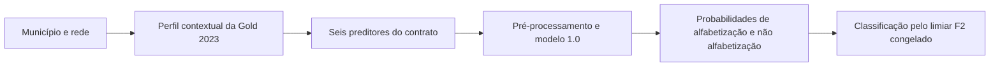

# Demonstração de previsão contextual

**Autor:** André Mohallem Ferraz. **Modelo:** versão 1.0, ajustada em 2023.

Esta demonstração responde: **“Qual é a probabilidade estimada de alfabetização de um aluno do 2º ano, considerando a rede de ensino e o contexto territorial e socioeconômico?”** O usuário informa município e rede; o script recupera os atributos históricos usados pelo modelo e apresenta as duas probabilidades e a classificação correspondente.

## O que significa alfabetizado

O critério observado é **proficiência maior ou igual a 743 pontos** para os registros elegíveis da avaliação. Esse critério define o rótulo usado no treinamento e na avaliação. A proficiência não entra na previsão: conhecê-la já permitiria determinar diretamente o rótulo e causaria vazamento de informação.

Já o **limiar probabilístico** converte a estimativa em classificação. A versão 1.0 usa a política F2 congelada: sinaliza o contexto quando `P(não alfabetizado) >= 0,15016323973380263`. Esse valor foi escolhido nas previsões de validação de 2023, priorizando sensibilidade. A saída também mostra a classificação com 0,5 como referência didática; ela não substitui a política F2.

Consequentemente, um perfil pode ter probabilidade de alfabetização superior a 50% e ainda ser sinalizado pela política F2. Isso expressa a prioridade dada à identificação de risco. No teste temporal de 2024, essa política sinalizou 96,84% dos alunos, limitando sua seletividade.

## Executar

Na raiz do projeto, após `uv sync --frozen`, com os artefatos e a Gold da cópia privada disponíveis:

```bash
uv run python -m src.usecase.predict_profiles --root . --municipio 3106200 --rede Municipal
```

Para os três perfis públicos de exemplo:

```bash
uv run python -m src.usecase.predict_profiles --root . --input examples/perfis-demonstracao.csv
```

Para salvar um novo arquivo:

```bash
uv run python -m src.usecase.predict_profiles --root . --input examples/perfis-demonstracao.csv --output /tmp/previsoes-contextuais.json
```

O arquivo de saída não pode existir. O CSV deve conter exatamente `id_municipio,rede_nome`, nessa ordem; são aceitas apenas as redes `Municipal` e `Estadual`. O código municipal deve ter sete dígitos, preservados como texto.

O repositório público contém os [perfis de entrada](../examples/perfis-demonstracao.csv) e a [saída real da demonstração](../examples/resultado-demonstracao.json), que podem ser consultados sem acesso aos dados individuais. A execução depende da Gold e do modelo disponíveis na entrega privada; o script não baixa nem aceita modelos externos.

## Exemplos produzidos pelo modelo congelado

| Município e rede | P(alfabetizado) | P(não alfabetizado) | Classificação F2 | Referência 0,5 |
|---|---:|---:|---|---|
| Belo Horizonte/Municipal | 58,66% | 41,34% | Não alfabetizado | Alfabetizado |
| Salvador/Municipal | 39,08% | 60,92% | Não alfabetizado | Não alfabetizado |
| Porto Alegre/Estadual | 54,60% | 45,40% | Não alfabetizado | Alfabetizado |

Esses valores são previsões para contextos existentes em 2023. Não são taxas municipais observadas, resultados de alunos identificados ou previsões para 2026. Foram escolhidos para ilustrar a saída e a diferença entre probabilidade e decisão; não constituem uma nova avaliação de desempenho.

## Fluxo e verificações



O script verifica os SHA-256 da decisão, do contrato, da Gold 2023 e do modelo. A desserialização do modelo ocorre somente depois da confirmação do hash, sobre os mesmos bytes verificados. O arquivo de 2024 não é necessário para executar a demonstração.

A leitura tabular projeta somente município, nome do município e os seis preditores: rede, UF, população de 2021, PIB per capita de 2020 e participações da agropecuária e dos serviços públicos no VAB de 2020. Nome e código municipal servem à consulta e à apresentação; não são enviados ao modelo. Alvo, proficiência, peso e identificadores individuais não são lidos como colunas ou apresentados. O cálculo do hash lê os bytes do arquivo completo para verificar sua integridade.

Município/rede ausente do desenvolvimento, atributos contraditórios para o mesmo perfil ou contexto incompleto causam erro explícito. A demonstração não extrapola automaticamente para municípios novos. Os testes verificam também a orientação das classes, a distinção entre políticas de decisão e a recusa de sobrescrita.

## Limites da interpretação

A estimativa é contextual: alunos com os mesmos seis atributos recebem a mesma probabilidade. Ela não substitui avaliação pedagógica individual e não comprova que uma característica cause alfabetização. As probabilidades são preservadas da versão 1.0, sem calibração adicional; os limites de diferenciação e calibração estão na avaliação temporal do projeto.

O enriquecimento com indicadores educacionais integra um estudo complementar. Seus atributos não alimentam esta demonstração da versão 1.0, e nenhum modelo, limiar ou artefato do experimento original é reajustado durante a execução.
