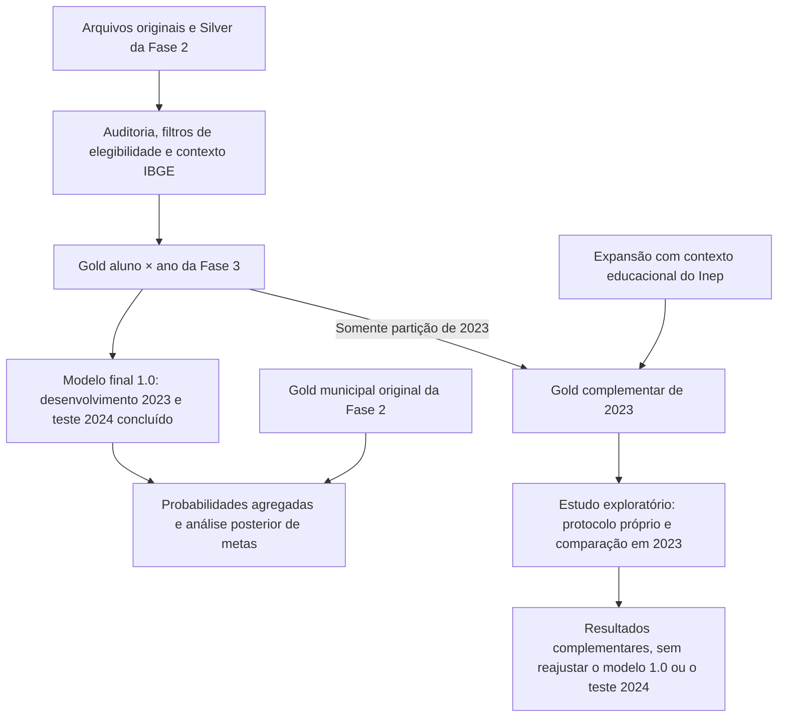

# Pergunta analítica, critérios e linhagem da Gold

**Autor: André Mohallem Ferraz · FIAP, Tech Challenge Fase 3 · 13/09/2026**

## Pergunta principal e pergunta complementar

> Qual é a probabilidade estimada de um aluno avaliado do 2º ano da rede Estadual ou
> Municipal ser considerado alfabetizado pelo critério de proficiência maior ou igual
> a 743 pontos, considerando sua rede de ensino e o contexto territorial e socioeconômico
> do município?

O modelo supervisionado aprende a relação entre os atributos de contexto e o resultado
observado. Ele entrega `P(alfabetizado)` e sua probabilidade complementar,
`P(não alfabetizado) = 1 - P(alfabetizado)`. Aplicar um limiar gera a classificação
binária exigida pelo desafio.

A pergunta complementar é: **quais variáveis mais contribuem para as estimativas do
modelo?** A [importância por permutação](../reports/importancia_permutacao_2023.csv)
avalia a perda de capacidade preditiva quando os valores de um atributo são permutados
na validação de 2023. Essa medida não estima o efeito causal de uma política, investimento
ou mudança no contexto do aluno.

## O critério do alvo e a decisão do modelo

| Elemento | Regra | Interpretação |
| --- | --- | --- |
| Alvo observado | Proficiência válida ≥ 743: alfabetizado; abaixo de 743: não alfabetizado. | Define o resultado que o modelo procura estimar. |
| Probabilidade | `p_alfabetizado` e `p_risco = 1 - p_alfabetizado`. | Expressa a estimativa condicionada aos atributos disponíveis. |
| Classificação de referência | `p_risco >= 0,5`: não alfabetizado; caso contrário: alfabetizado. | Regra de referência; no empate em 0,5, a classe é não alfabetizado. |
| Política F2 congelada | Sinalizar quando `p_risco >= 0,15016323973380263`. | Prioriza identificar não alfabetizados, aceitando mais falsos positivos. |

O [Inep](https://www.gov.br/inep/pt-br/areas-de-atuacao/avaliacao-e-exames-educacionais/avaliacao-da-alfabetizacao)
estabelece o padrão nacional de alfabetização de 743 pontos. A implementação
[confere a equivalência entre nota e rótulo](../src/preprocessing/validation.py), mas
não utiliza a nota como entrada do modelo: isso revelaria diretamente a resposta.
Ausentes, avaliações sem nota válida e eventos sintéticos ficam fora do estudo.

O limiar F2 foi escolhido com previsões de validação de 2023, antes do teste de 2024,
conforme o [protocolo final](../reports/protocolo-final.md). Ele não altera o padrão
de 743 pontos. No teste, sinalizou 96,84% dos alunos: seu uso exige reconhecer a baixa
seletividade e não constitui uma regra pronta para atendimento individual.

Como exemplo **apenas aritmético**, uma estimativa de 75% de alfabetização corresponde
a 25% de risco. Pela referência de 0,5, a previsão é alfabetizado; pela política F2,
o caso é sinalizado para atenção. A diferença decorre das políticas de decisão, mantendo
a mesma estimativa. O exemplo não é uma previsão calculada para um aluno real.

Probabilidades são estimativas, não certezas sobre uma criança. Sua qualidade foi
examinada pelo Brier e pela [curva de calibração do teste](../reports/calibracao_teste_2024.csv),
sem recalibrar o modelo após observar o resultado. Não são utilizadas faixas arbitrárias
de risco baixo, médio ou alto.

## Por que adaptar a Gold da Fase 2

A Gold municipal anterior contém indicadores e metas agregados. Uma linha por município
não fornece os exemplos individuais e seus rótulos necessários ao treinamento de um
classificador por aluno. Por isso, a Fase 3 reconstrói uma Gold no grão **aluno × ano**
a partir da Silver e dos arquivos originais da Fase 2, com auditoria de chaves e campos,
filtros de elegibilidade e enriquecimento com IBGE.

Essa Gold é uma adaptação documentada da engenharia anterior. O modelo não foi treinado
diretamente na mesma tabela Gold municipal entregue na Fase 2. A tabela municipal original
entra posteriormente na análise de metas, sem fornecer atributos nem orientar a escolha
do modelo.

O fluxo do modelo 1.0 está implementado. O ramo do Inep representa a ampliação complementar
em estudo; sua análise não muda a avaliação temporal já concluída.

O [snapshot de entradas](../config/snapshot.json), a [auditoria da Gold](../reports/gold_build.json)
e a [reprodução completa](../reports/reproducibilidade_completa.json) registram essa linhagem.
As fontes anteriores são preservadas e os dados individuais permanecem na cópia privada.

## O que a previsão pode distinguir

O modelo final 1.0 usa rede, UF e quatro indicadores do IBGE: população, PIB per capita,
participação da agropecuária no VAB e participação dos serviços públicos no VAB.
Existem 5.881 perfis desses seis atributos no desenvolvimento de 2023. Alunos que compartilham
um perfil recebem a mesma probabilidade, mesmo que tenham trajetórias pedagógicas diferentes.

Os identificadores não comprovam acompanhamento da mesma criança entre anos e não há chave
externa escolar validada. Assim, uma expansão por município e rede acrescenta contexto
educacional, mas não equivale a conhecer a escola, a família ou a trajetória individual.

O estudo complementar do Inep deve avaliar indicadores educacionais históricos com vínculo
territorial válido e período de publicação compatível. Seu papel é testar se acrescentam
informação aos atributos atuais. Como 2024 já foi observado, uma comparação adicional em
2023 será apresentada como exploratória; uma nova alegação de generalização exige outro
teste reservado e protocolo apropriado. A [decisão do modelo final 1.0](../config/modelo-final.json)
e seus resultados permanecem preservados.
