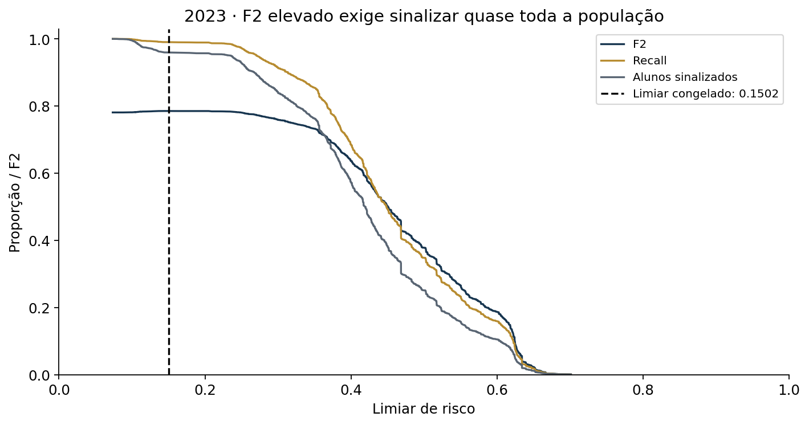
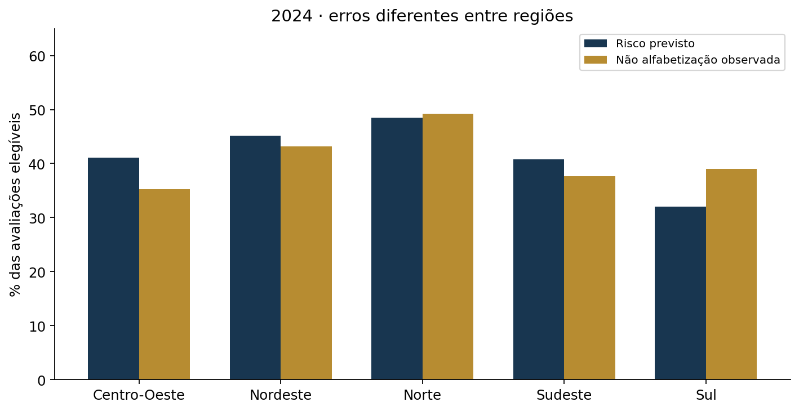
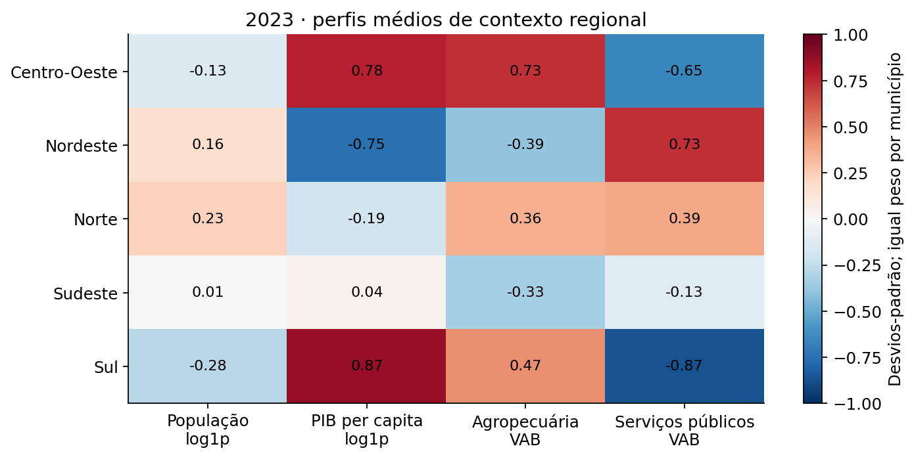

# Relatório técnico — alfabetização no Brasil

**Autor: André Mohallem Ferraz**

**FIAP · Tech Challenge Fase 3 · Trabalho individual · Revisão documental 1.1 · 13/09/2026**

**Síntese executiva.** O Gradient Boosting supera o baseline no teste temporal, com AP 0,5162 e ROC-AUC 0,6224. Seu limiar acadêmico de F2 sinaliza 96,84% dos alunos. A entrega evidencia potencial para leitura territorial e limites importantes de generalização e seletividade, sem recomendar decisões individuais autônomas.

## 1. Contexto do problema

A Fase 2 construiu a engenharia de dados do Indicador Criança Alfabetizada (ICA), dos
territórios e das metas. Esta entrega reconstrói uma Gold por aluno/ano a partir das
fontes auditadas daquela pipeline e utiliza sua Gold municipal na análise posterior de
metas. O projeto é independente e preserva a entrega anterior.

O padrão nacional de alfabetização corresponde a 743 pontos na escala Saeb. A própria
proficiência define o rótulo e, portanto, não pode ser usada como preditor.
[Referência: Inep, Avaliação da Alfabetização](https://www.gov.br/inep/pt-br/areas-de-atuacao/avaliacao-e-exames-educacionais/avaliacao-da-alfabetizacao).

## 2. Objetivo analítico

Estimar `P(alfabetizado)` para avaliações válidas do 2º ano das redes Estadual e Municipal.
A classe de interesse na avaliação é não alfabetizado: `p_risco = 1 - P(alfabetizado)`.
Chave: `(ano, id_aluno)`. Identificadores não permitem acompanhar a mesma criança entre anos.
Os atributos são contextuais; alunos com os mesmos atributos recebem a mesma probabilidade.

<!-- pagebreak -->
## 3. Base utilizada

| Recorte auditado | 2023: desenvolvimento | 2024: teste temporal |
| --- | ---: | ---: |
| Avaliações reais elegíveis | 1.502.809 | 1.851.828 |
| Municípios | 4.871 | 5.517 |
| UFs presentes no recorte | 23 | 26 |
| Eventos sintéticos excluídos da Silver | 1.518 | 1.482 |

Foram excluídos os 3.000 eventos simulados de streaming, ausentes, avaliações sem
proficiência/rótulo válido e redes fora do escopo. Total elegível: **3.354.637 avaliações**.
Os dez campos de origem auditados da Silver batch foram confrontados com os originais.
As primeiras estimativas dos documentos de planejamento 01/02 foram corrigidas na definição
analítica 03 e na construção da Gold. A contagem acima é a versão válida da entrega.

**Enriquecimento com bases externas do IBGE.** A base de alunos da Fase 2 foi cruzada
com duas bases públicas do Instituto Brasileiro de Geografia e Estatística (IBGE):

| Base externa e arquivo de origem | Ano de referência | Atributos acrescentados ao modelo |
| --- | --- | --- |
| [IBGE — Estimativas da População, publicação no DOU](https://ftp.ibge.gov.br/Estimativas_de_Populacao/Estimativas_2021/estimativa_dou_2021.ods) | 2021 | População do município |
| [IBGE — Produto Interno Bruto dos Municípios, edição 2020](https://ftp.ibge.gov.br/Pib_Municipios/2020/base/base_de_dados_2010_2020_txt.zip) | 2020, selecionado no arquivo da série 2010–2020 | PIB per capita; participação da agropecuária no VAB; participação dos serviços públicos no VAB |

O cruzamento usa o **código IBGE do município (`id_municipio`)**, com cobertura de 100%
dos municípios elegíveis de 2023 e 2024. As participações econômicas são calculadas como
percentual do valor adicionado bruto (VAB) total. O enriquecimento é municipal: cada aluno
recebe o contexto de seu município.

São **quatro atributos externos do IBGE**, somados à **rede de ensino e à UF da Fase 2**,
totalizando os seis preditores. As edições externas foram publicadas até 31/12/2022 e
são mantidas iguais nos dois ciclos. PIB per capita não é renda familiar; VAB de serviços
públicos não é gasto em educação. URLs, datas de publicação e hashes dos arquivos estão
no [manifesto das fontes externas](../config/fontes-externas.json).

Metas, indicadores contemporâneos, proficiência, rótulos, IDs e peso ficam fora de X.
A Gold municipal da Fase 2 entra somente na leitura posterior das metas, sem orientar o modelo.
[Contrato](../config/contrato-ml-aluno.json) · [Dicionário](../config/dicionario-variaveis.csv) ·
[Snapshot de oito arquivos](../config/snapshot.json) · [Preparação das entradas](../data/README.md).

<!-- pagebreak -->
## 4. Etapas de modelagem

A EDA inicial examinou exclusivamente 2023: distribuição do alvo, diferenças por região,
UF e rede, distribuições numéricas, valores ausentes e repetição dos perfis de atributos.
A síntese abaixo relaciona essas evidências e a hipótese de contribuição do IBGE às
decisões adotadas. As correlações, calculadas posteriormente na interpretação, são
apresentadas separadamente na seção 4.3.

### 4.1. Da EDA às hipóteses e decisões

| Evidência no desenvolvimento de 2023 | Hipótese ou justificativa | Decisão e forma de avaliação |
| --- | --- | --- |
| Os quatro atributos do IBGE variam entre municípios. | H1: o contexto numérico pode acrescentar informação além de rede e UF. | Comparar variantes rede/UF e completa nos mesmos três folds, mantendo a população de validação. |
| População: média 33.245,10 e mediana 11.563 habitantes. PIB per capita: média R$ 26.098,86 e mediana R$ 18.256,44. | Caudas à direita e escalas diferentes justificam transformar os dados no modelo linear. | Aplicar log1p em população/PIB e padronizar os quatro numéricos na logística. O boosting usa valores sem log ou padronização. |
| Não alfabetizados: 625.382 avaliações, ou 41,61%. | A classe de interesse tem volume expressivo; não há justificativa inicial para gerar exemplos artificiais. | Usar baseline de prevalência e AP da classe de risco; comparar modelos sem reamostragem ou ponderação de classes nesta rodada. |
| Norte: 48,89% de não alfabetização; Sul: 32,27%. Apenas 5.881 perfis em 1.502.809 avaliações. | Heterogeneidade territorial e contextos repetidos limitam a independência entre alunos. | Separar folds por município, usar uma linha por município nas distribuições econômicas e avaliar erros regionais e municípios novos. |
| Nenhum valor ausente nos quatro preditores numéricos. | A imputação precisa estar definida, embora não seja necessária nos dados utilizados. | Incluir mediana aprendida somente no treino. A pipeline contém o mecanismo; a construção atual da Gold exige contexto completo. |

O comparativo da logística deu suporte descritivo a H1: AP média de **0,533285** com
rede/UF e **0,538103** com os seis atributos, diferença **+0,004819**, positiva nos três
folds. Isso não demonstra causalidade nem significância estatística. Também não foi
realizado um experimento isolando o efeito do log1p, da padronização ou da reamostragem;
essas escolhas não são apresentadas como causas comprovadas de melhora.

[EDA inicial](../reports/eda_development.md) · [Distribuições numéricas](../reports/eda_numericas_municipios_2023.csv) ·
[Diferenças por região](../reports/eda_regiao_2023.csv) · [Ganho do enriquecimento por fold](../reports/logistica_delta_enriquecimento_2023.csv).

<!-- pagebreak -->

### 4.2. Pipeline integrada e controles de validação

Três folds fixos separam municípios inteiros: 500.934, 500.942 e 500.933 alunos.
O mapa de folds foi definido antes da modelagem, sem consultar rótulos. Em cada rodada,
dois folds treinam e o terceiro valida. Os municípios de validação não aparecem no treino.

| Família | Pré-processamento e ajuste |
| --- | --- |
| Baseline | DummyClassifier prior, proporção aprendida no treino |
| Logística | Imputação constante categórica, one-hot, mediana numérica, log1p em população/PIB, StandardScaler; L2, C=1 |
| Gradient Boosting | Imputação categórica constante; códigos explicitamente nominais, inéditos como NaN; mediana numérica, sem escala ou log |

No boosting, `early_stopping=False` evita uma divisão interna aleatória de alunos que
poderia repartir um mesmo município entre treino e validação interna.
Não se usa ponderação ou balanceamento de classes no ajuste. Pesos são suplementares na
avaliação. A imputação está implementada e testada, mas nenhum valor numérico precisou
ser preenchido no snapshot utilizado. Uma nova carga com contexto incompleto é bloqueada
pela validação da Gold e exige revisão da origem dos dados.

O `ColumnTransformer` organiza as transformações numéricas e categóricas dentro da
`Pipeline` do Scikit-learn, junto com o classificador. Medianas, categorias e parâmetros
de escala são aprendidos apenas no treino de cada fold. O objeto persistido contém
pré-processamento e modelo; as mesmas transformações são reaplicadas na previsão.

Para prevenir vazamento, uma lista explícita limita X aos seis preditores. Proficiência,
rótulos, resultados contemporâneos, metas, pesos e identificadores não entram no modelo.
Os dados externos são anteriores a 2023. Modelo e limiar foram congelados com o
desenvolvimento antes da avaliação temporal de 2024.

A **reprodutibilidade foi verificada computacionalmente**, com métricas e arquivos finais
reproduzidos. A **generalização foi avaliada empiricamente** por validação entre municípios
e teste temporal reservado; apresentou limitações, principalmente em municípios e UFs
novos. Os resultados não garantem desempenho equivalente em qualquer população futura.

[Pré-processamento](../src/preprocessing/) · [Modelos integrados](../src/modeling/) ·
[Reprodução completa](../reports/reproducibilidade_completa.json) · [Teste temporal](../reports/teste_temporal_2024.json).

### 4.3. Correlações na interpretação complementar

As correlações municipais foram calculadas na etapa posterior de interpretação,
exclusivamente com 2023, sem redefinir atributos, modelo ou limiar. Spearman com a taxa
municipal de não alfabetização: **+0,182** para população, **−0,266** para PIB per capita,
**−0,196** para agropecuária e **+0,284** para serviços públicos. Há uma observação por
município. Essas associações complementam a interpretação exploratória; não demonstram
causalidade e não são justificativas retrospectivas para a seleção inicial do modelo.
[Matriz de correlações](../reports/correlacoes_municipais_2023.csv).

<!-- pagebreak -->
## 5. Escolha do algoritmo

A logística foi comparada com rede/UF e com todos os seis atributos. O boosting passou
por seis configurações por variante, com 150.000 alunos selecionados por hash da chave
(50.000 por fold), sem consultar rótulos. Busca: 7/15/31 folhas × 100/200 iterações;
learning rate 0,05, mínimo de 100 alunos por folha, L2=1, semente 42 e uma thread.

| Modelo | AP média em CV 2023 | ROC-AUC média |
| --- | ---: | ---: |
| Baseline | 0,416142 | 0,500000 |
| Logística rede/UF | 0,533285 | 0,636130 |
| Logística completa | 0,538103 | 0,639364 |
| Boosting rede/UF | 0,533581 | 0,636780 |
| Boosting completo | **0,543776** | **0,642578** |

Selecionado o boosting completo, com 7 folhas e 100 iterações, por maior AP média.
O limiar **0,15016323973380263** maximiza F2 nas previsões fora de fold de 2023.
Configuração e ajuste final foram registrados no commit `e9d5708`, antes do teste de 2024.
A CV não é aninhada, pois a busca reutiliza amostra dos folds; seus resultados podem ser
otimistas. O teste temporal ficou fora de qualquer seleção, inclusive de limiar e calibração.

[Busca e configuração](../reports/boosting_protocolo.md) · [Decisão final](../config/modelo-final.json).

<!-- pagebreak -->
## 6. Métricas de avaliação

AP = average precision da classe não alfabetizado; não é acurácia nem precisão de uma
classificação binária. Os resultados de teste abaixo são calculados sobre cada recorte completo.

| Teste 2024 | Alunos | AP | ROC-AUC | Brier ↓ |
| --- | ---: | ---: | ---: | ---: |
| Todos | 1.851.828 | **0,516165** | **0,622375** | **0,228842** |
| Municípios presentes em 2023 | 1.423.709 | 0,529462 | 0,641279 | 0,225102 |
| Municípios novos | 428.119 | 0,456451 | 0,559467 | 0,241280 |
| Baseline treinado em 2023, teste completo | 1.851.828 | 0,402157 | 0,500000 | 0,240622 |

| Decisão no teste completo | Recall | Precisão | Especificidade | Alunos sinalizados | F2 |
| --- | ---: | ---: | ---: | ---: | ---: |
| Limiar F2 congelado | 99,30% | 41,24% | 4,81% | 96,84% | 0,774795 |
| Referência 0,5 | 25,75% | 56,88% | 86,87% | 18,21% | 0,289192 |

O F2 do baseline que sinaliza todos é 0,770821: o ganho operacional do limiar otimizado
é pequeno. O teste não foi usado para melhorar esses números após sua observação.
As métricas ponderadas e todas as matrizes de confusão estão no [JSON temporal](../reports/teste_temporal_2024.json).

<!-- pagebreak -->
## 7. Interpretação dos resultados

Permutação em validação de 2023, com 5 repetições em cada fold, mostra maior dependência
de UF (queda média de AP 0,114826), seguida de serviços públicos/VAB (0,004855), população
(0,004705), PIB per capita (0,003733) e rede (0,001614). Agropecuária teve contribuição
marginal próxima de zero (−0,000494). Nenhum atributo foi retirado após olhar o teste.

Atributos territoriais foram permutados por município; rede, por aluno. Correlações e
combinações pouco plausíveis geradas pela permutação limitam a leitura. Os desvios entre
repetições não são intervalos de confiança. Importância não é efeito causal.

<!-- pagebreak -->
## 8. Insights encontrados

- AC, DF e SP são UFs inéditas em relação ao desenvolvimento, com 427.789 avaliações.
  Elas concentram 99,92% dos alunos de municípios novos. O desempenho nesse recorte é menor.
- No Sul, o risco médio previsto ficou 6,98 pontos percentuais abaixo do observado.
  No Centro-Oeste, ficou 5,81 pontos acima. Uma média nacional oculta erros regionais.
- Aracaju/SE e Nossa Senhora do Socorro/SE lideram o risco médio previsto entre municípios
  com ao menos 100 avaliações. Os dez primeiros estão em Sergipe: essa concentração
  evidencia a dependência de UF e não estabelece um ranking oficial de vulnerabilidade.
- Centro-Oeste e Sul têm os perfis de contexto mais próximos nesta análise de 2023
  (distância padronizada 0,381), com igual peso por município; isso não implica taxas de
  alfabetização iguais ou padrões individuais semelhantes.

[Municípios](../reports/municipios_risco_2024.csv) · [Regiões](../reports/regioes_teste_2024.csv) ·
[Perfis semelhantes](../reports/regioes_semelhantes_2023.csv).

<!-- pagebreak -->
## 9. Limitações

Só há 5.881 perfis de seis atributos em 2023; milhões de alunos não equivalem a milhões
de contextos independentes. Ausentes não têm desfecho observado. O snapshot não comprova
cadastro individual anterior à prova. Não há chave escolar externa nem identidade
longitudinal validadas. A cobertura muda entre ciclos e Roraima está ausente do recorte final.

O contexto é de 2020/2021; a generalização temporal e para novas UFs é limitada.
A análise não mede efeitos de políticas, evolução de crianças ou desempenho de escolas.
O limiar F2 tem baixa seletividade e não é recomendado como mecanismo autônomo de triagem.
As ponderações reproduzem `peso_aluno` da fonte; não transformam este recorte em ICA oficial
nem comprovam representatividade nacional. Não foram estimados intervalos de confiança.

## 10. Aplicação prática para políticas públicas

Usar as tabelas para levantar hipóteses territoriais, verificar cobertura e planejar
investigação pedagógica. Combinar risco, volume de alunos, evidências locais e capacidade
de atendimento. Prioridades de orçamento ou decisões individuais exigem validação adicional.

Para metas, a média ponderada de `P(alfabetizado)` é comparada à referência da Gold Fase 2:
1.592 dos 2.819 municípios com n ≥ 100 e meta de 2024 ficam abaixo dessa referência.
É uma comparação no recorte modelado, não reprodução do indicador oficial.

No cenário de referência de 80%, mantendo a composição e os atributos de 2024, 2.767
municípios ficam abaixo entre os 2.924 publicados. **Não é previsão de 2030** nem
probabilidade de descumprir uma meta. Uma previsão futura exige população/atributos
compatíveis com o ciclo e validação temporal adicional.
[Cenários e cobertura](../reports/cenarios_metas_2024.csv).

<!-- pagebreak -->
## 11. Possíveis evoluções futuras

Validar chaves para incorporar informações escolares anteriores à prova; ampliar ciclos
e cobertura; estudar calibração fora do teste já observado; escolher políticas de decisão
com capacidade/custos reais; medir incerteza por município e monitorar erro regional.
Qualquer novo experimento deve reservar outro teste, mantendo esta versão como registro.

## Como reproduzir

Python 3.12, dependências diretas e transitivas fixadas em `pyproject.toml` e `uv.lock`.
Com os oito arquivos de entrada descritos em [data/README.md](../data/README.md):

O último comando reconstrói a Gold, EDA, baseline, logística, busca de boosting, ajuste
final e teste em pastas temporárias. Mantém os recibos históricos depois de confrontar
as métricas recalculadas (tempos excluídos). A decisão já publicada não é reescolhida.
O teste fica ausente da pasta de ajuste final até o treinamento terminar.

Na cópia privada que já contém Gold e artefatos, também é possível usar
`uv run python -m src.usecase.reproduce_final`. A etapa `temporal` recusa sobrescrever
o teste. `run-all`, `logistic` e `boosting` são bloqueados na raiz congelada para preservar
a proveniência; a reprodução completa executa essas funções em uma raiz temporária.
`interpret`, `strategy` e `final-figures` exportam análises sem retreinar o modelo final.

Verificação: **70 testes aprovados**. Reprodução final com métricas exatamente iguais,
quatro arquivos idênticos por SHA-256 e 1.000 previsões conferidas após reabrir o modelo.
Veja [reprodução completa](../reports/reproducibilidade_completa.json) e [final](../reports/reproducibilidade_final.json).
As 14 advertências remanescentes são de depreciação de Matplotlib/Pyparsing.

O repositório público contém código, documentação e agregados. Os dados individuais e
modelos ficam na cópia privada e no pacote completo de entrega. As fontes originais são
públicas, mas este snapshot precisa ser preparado conforme o manifesto; executar os testes
não exige os arquivos reais. O vídeo e os documentos finais são publicados como arquivos da versão.

<!-- pagebreak -->
## Referências

- [Fase 2: engenharia de dados e Gold municipal](https://github.com/andreferraz-fiap-fase2/tech-challenge-fase2).
- [IBGE: população DOU 2021](https://ftp.ibge.gov.br/Estimativas_de_Populacao/Estimativas_2021/estimativa_dou_2021.ods).
- [IBGE: PIB dos Municípios, edição 2020](https://ftp.ibge.gov.br/Pib_Municipios/2020/base/base_de_dados_2010_2020_txt.zip).
- [Inep: ICA e metas](https://www.gov.br/inep/pt-br/areas-de-atuacao/avaliacao-e-exames-educacionais/avaliacao-da-alfabetizacao).
- [Scikit-learn 1.7: HistGradientBoostingClassifier](https://scikit-learn.org/1.7/modules/generated/sklearn.ensemble.HistGradientBoostingClassifier.html).

Os documentos de etapas anteriores registram o estado na data de sua elaboração. Este
README, o relatório final e a decisão congelada representam o estado da entrega.

## Apêndice — perfis regionais

<!-- pagebreak -->
## Apêndice — distribuições do contexto

Uma observação por município no desenvolvimento de 2023. A escala log10 desta figura é apenas visual; o modelo logístico utiliza log1p.

