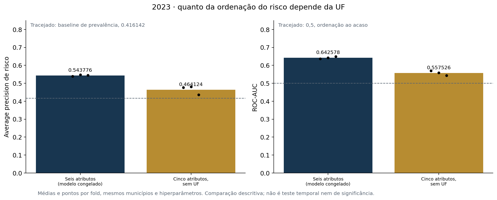

# Ablação da UF · desenvolvimento de 2023

Responde a lacuna registrada na seção 6.2 do README: quanto da ordenação do risco depende da sigla da unidade federativa. As duas variantes usam os mesmos três folds municipais, os mesmos 1.502.809 alunos e hiperparâmetros idênticos aos do modelo congelado 1.0. A única diferença é a remoção de `sigla_uf` dos preditores.

| Variante | AP média | ROC-AUC média | Brier médio ↓ |
| --- | ---: | ---: | ---: |
| Seis atributos (modelo congelado) | 0.543776 | 0.642578 | 0.227481 |
| Cinco atributos, sem UF | 0.464124 | 0.557526 | 0.240775 |

Remover a UF custa **0.079652 de AP média**, o equivalente a **62.4% da vantagem** que o modelo congelado tem sobre o baseline de prevalência (0.416142). Por fold: fold 0: -0.063269 · fold 1: -0.067099 · fold 2: -0.108590.

## Como ler

A variante sem UF preserva rede de ensino e os quatro atributos do IBGE. O que ela perde é a capacidade de distinguir estados. A comparação é descritiva: não há teste de significância, intervalo de confiança nem novo recorte independente.

A referência de seis atributos foi reajustada nesta rodada e reproduziu exatamente as métricas publicadas em `modelos_comparacao_2023.csv`, fold a fold. Isso confirma que a diferença observada vem da remoção do atributo e não do procedimento.

## Limites

O teste temporal de 2024 já havia sido observado quando esta ablação foi executada e não foi carregado. O modelo final, o limiar congelado e a avaliação temporal 1.0 permanecem os mesmos; esta análise é interpretativa e não promove nova candidata. Dependência preditiva não é efeito causal: a UF resume diferenças de rede, política e composição que o recorte não separa.

[Protocolo](../config/experimento-ablacao-uf.json) · [Métricas por fold](ablacao_uf_2023.csv) · [Diferenças por fold](ablacao_uf_deltas_2023.csv)

