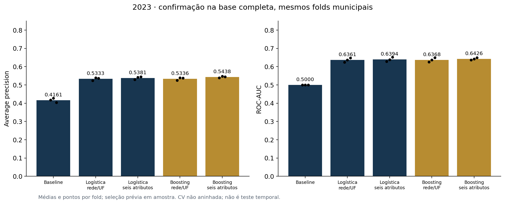
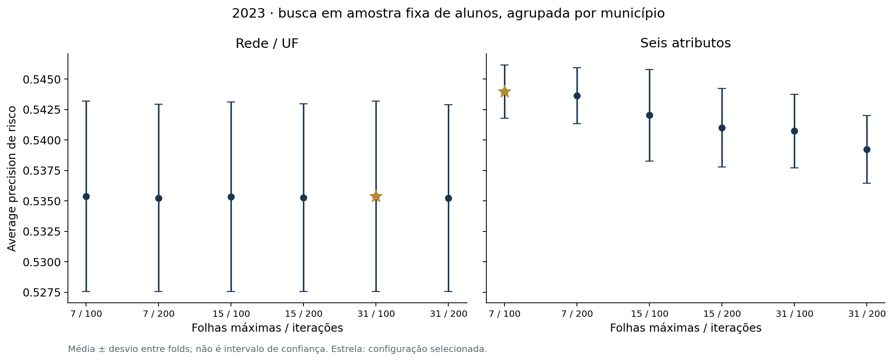

# Gradient Boosting e busca limitada · desenvolvimento de 2023

Busca em amostra fixa, sem rótulos na seleção de alunos. Vencedor por AP de risco média, separado por variante. Confirmação na Gold completa, nos mesmos três folds municipais.

| Modelo | AP média ± DP | ROC-AUC | Brier | Recall em 0,5 |
| --- | ---: | ---: | ---: | ---: |
| Baseline | 0.4161 ± 0.0115 | 0.5000 | 0.2431 | 0.00% |
| Logística · rede/UF | 0.5333 ± 0.0086 | 0.6361 | 0.2288 | 31.67% |
| Logística · seis atributos | 0.5381 ± 0.0084 | 0.6394 | 0.2284 | 36.75% |
| Boosting · rede/UF | 0.5336 ± 0.0078 | 0.6368 | 0.2287 | 33.69% |
| Boosting · seis atributos | 0.5438 ± 0.0040 | 0.6426 | 0.2275 | 34.71% |

DP = desvio entre folds, não intervalo de confiança. AP não é acurácia nem precisão no limiar 0,5. Classe de interesse: não alfabetizado.

## Configurações selecionadas

- boosting_rede_uf: `leaves31_iter100`.
- boosting_completa: `leaves7_iter100`.

Amostra: 150,000 avaliações, 4,810 municípios. Seis candidatos por variante; parâmetros completos no protocolo e JSON.

## Limites e próximos passos

A busca reutiliza uma amostra dos folds da confirmação: CV não aninhada, sujeita a otimismo por seleção. Nenhum resultado desta tabela é de teste temporal. A Gold de 2024 não foi avaliada. Não há modelo final nem limiar operacional escolhido.

Atributos territoriais produzem risco contextual, sem demonstrar causas individuais. O ganho da variante completa deve ser comparado à variante rede/UF do mesmo algoritmo. Pesos não entram no ajuste; métricas ponderadas suplementares estão no JSON.

Próxima etapa: consolidar escolha com 2023, interpretar previsões e definir/congelar o limiar antes de uma avaliação temporal única em 2024.

[Protocolo](boosting_protocolo.md) · [Busca por fold](boosting_busca_2023.csv) · [Confirmação por fold](modelos_comparacao_2023.csv)

