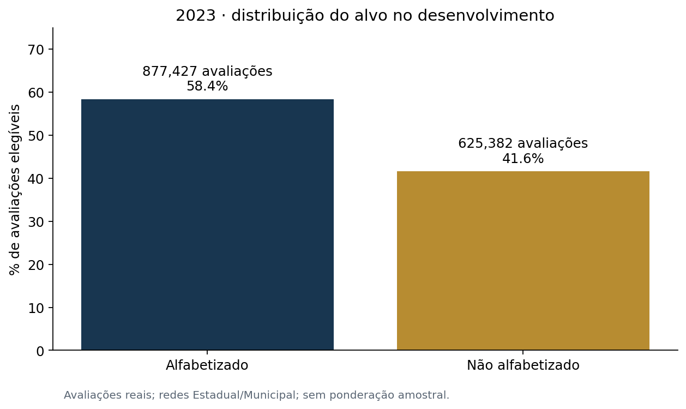
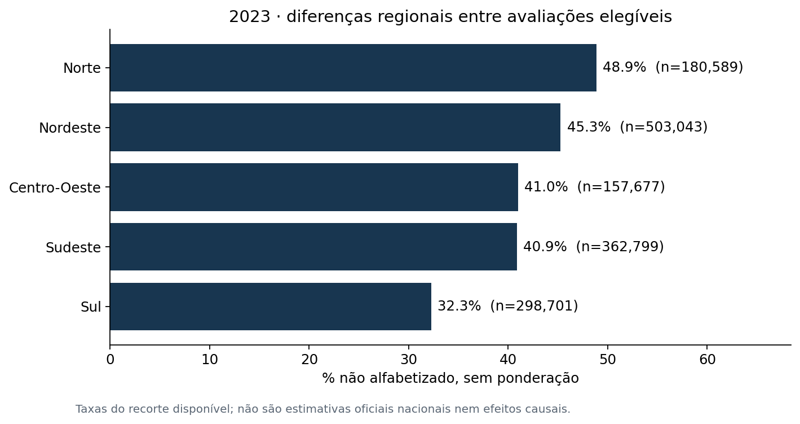
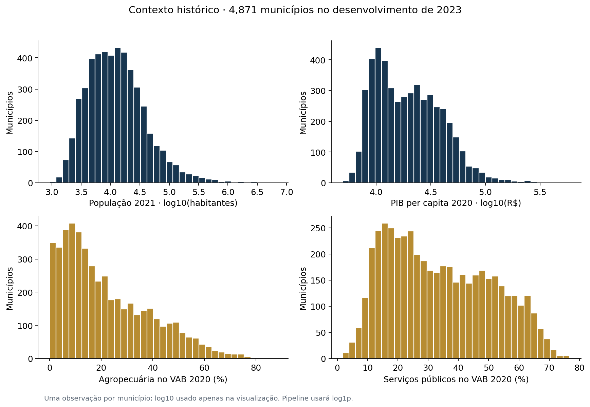
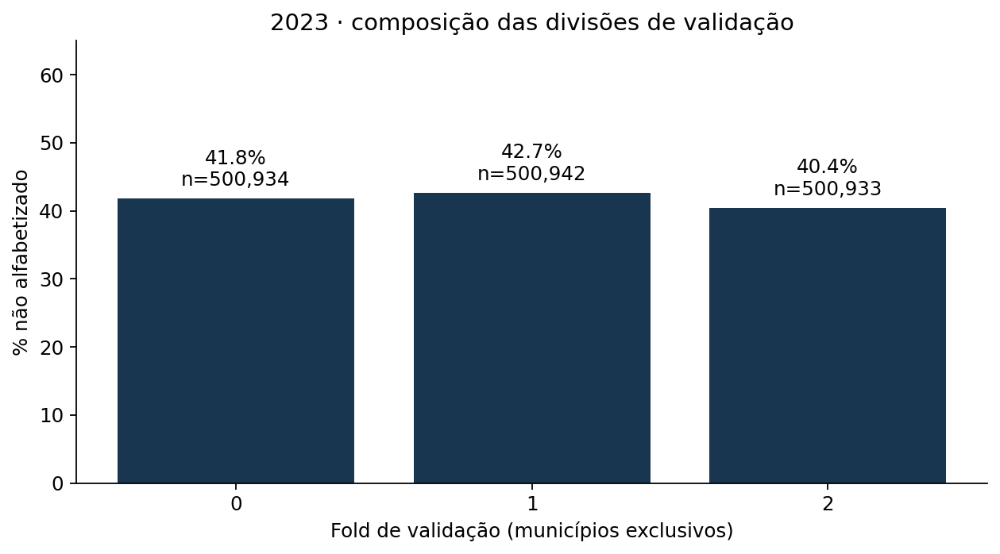

# EDA inicial — desenvolvimento de 2023

População: **1,502,809 avaliações reais elegíveis**, em
**4,871 municípios**, após excluir a simulação de streaming,
ausentes, avaliações sem proficiência válida e redes fora do escopo.

- Não alfabetizados: **625,382**, ou **41.61%**,
  sem ponderação. As classes são desiguais, mas a classe de risco tem volume expressivo;
  não há justificativa inicial para aplicar geração artificial de exemplos.
- O recorte regional vai de **32.27%** de não alfabetização
  em **Sul** até **48.89%** em **Norte**.
  Isso motiva reportar métricas por território; não demonstra causalidade nem representa
  uma classificação definitiva de todas as crianças de cada região.
- Os seis atributos estão completos no snapshot. A futura pipeline ainda deverá conter
  imputação para operar de forma definida diante de ausências em outras cargas, ajustada
  exclusivamente no treino de cada fold.
- Há **5,881 combinações distintas dos seis preditores**,
  frente a 1,502,809 avaliações. O modelo inicial estima risco contextual;
  não diferencia alunos com atributos idênticos e não acompanha a mesma criança entre anos.
- As distribuições econômicas usam **uma linha por município**, evitando que municípios
  mais populosos apareçam repetidos milhares de vezes no mesmo histograma. Os gráficos
  de população e PIB usam escala logarítmica para tornar as diferenças de porte legíveis.

## Figuras

## Como interpretar

As tabelas por região, UF, rede e fold trazem volumes e taxas não ponderadas, além de
uma visão ponderada por peso_aluno. Esses pesos não foram usados como preditores;
sua interpretação e a cobertura territorial deverão ser discutidas antes de inferir
representatividade populacional. Esta EDA não mede poder preditivo ou efeito de políticas.

**A partição de 2024 não foi lida pelos comandos de EDA ou baseline.** Ela foi somente
materializada e validada durante a construção da Gold. O próximo experimento comparará
modelos no desenvolvimento sob os folds já definidos.
