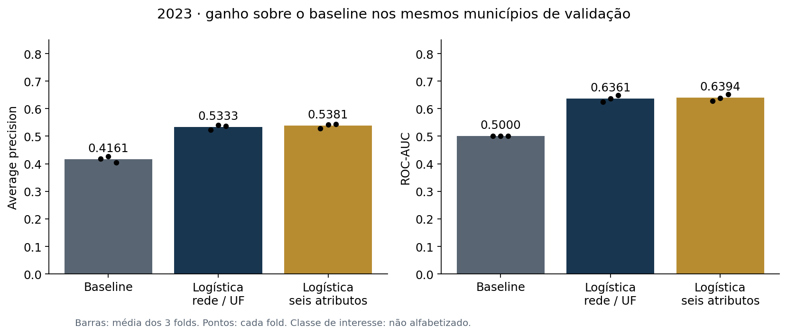
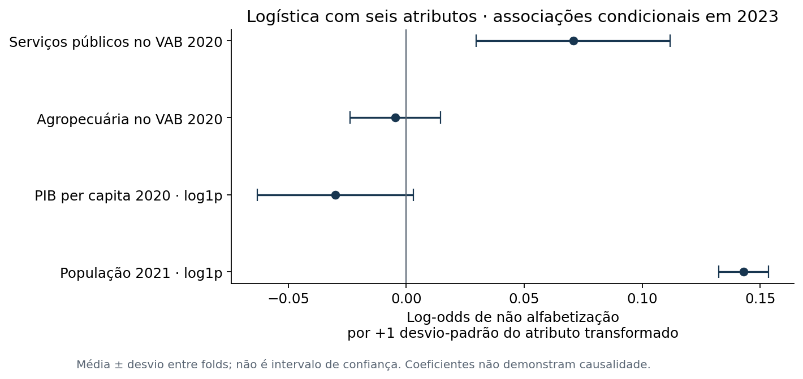

# Regressão Logística — comparação no desenvolvimento de 2023

Foram treinadas duas variantes nos mesmos três folds por município e nas
1.502.809 avaliações de 2023: rede/UF e todos os seis preditores. Os parâmetros
foram fixados antes da execução: L2, C=1, solver lbfgs, tolerância 1e-6 e máximo
de 1.000 iterações. Não houve busca de parâmetros, ponderação do ajuste ou balanceamento de classes.

Cada fold contém uma pipeline independente: padronização das representações de ausência,
imputação categórica constante, one-hot com categoria desconhecida ignorada, mediana
numérica no treino, log1p de população/PIB e StandardScaler nas quatro numéricas.
Nenhuma transformação aprende com o fold de validação. Colunas inteiramente ausentes
no treino são mantidas (fallback numérico zero); esse caso não ocorreu no snapshot real.

## Resultados

Médias simples dos três folds; classe positiva de avaliação = não alfabetizado.
Recall e precisão usam limiar de risco 0,5, sem otimização.

| Modelo | Average precision | ROC-AUC | Brier ↓ | Recall | Precisão |
| --- | ---: | ---: | ---: | ---: | ---: |
| Baseline constante | 0.4161 | 0.5000 | 0.2431 | 0.00% | 0.00% |
| Logística: rede/UF | 0.5333 | 0.6361 | 0.2288 | 31.67% | 57.71% |
| Logística: seis atributos | 0.5381 | 0.6394 | 0.2284 | 36.75% | 56.14% |

## Contribuição do enriquecimento

Diferença **seis atributos menos rede/UF**, calculada em cada fold:

| Fold | Delta AP | Delta ROC-AUC | Delta Brier |
| --- | ---: | ---: | ---: |
| 0 | +0.005019 | +0.004741 | -0.000302 |
| 1 | +0.002004 | +0.001799 | -0.000273 |
| 2 | +0.007433 | +0.003162 | -0.000579 |

Delta médio de AP: **+0.004819**, ou **+0.482 pontos percentuais**.
Esse resultado mede a contribuição dos quatro atributos numéricos dentro deste modelo
linear e deste protocolo. Não mede um efeito causal nem comprova significância estatística.
O desvio entre três folds não é um intervalo de confiança.

## Interpretação inicial

Os coeficientes foram exportados por variante/fold. Para ler risco de não alfabetização,
o sinal é o inverso do coeficiente do alvo alfabetizado. Nas numéricas, a unidade é
um desvio-padrão da variável após a transformação do respectivo treino. Nos indicadores
categóricos, a comparação entre duas categorias usa a diferença dos coeficientes;
não comparar sua magnitude diretamente com a das numéricas como ranking de importância.

Uma associação ajustada pode ter sinal diferente de uma correlação descritiva por
causa dos outros atributos incluídos e das dependências entre eles. PIB per capita
não é renda familiar; a participação dos serviços públicos no VAB não é gasto educacional.
Os 5.881 perfis de entrada continuam limitando a diferenciação individual.

## Artefatos e limites desta rodada

- `logistica_development.json`: configurações, fontes congeladas, convergência,
  iterações, tempos e métricas ponderadas/não ponderadas por fold.
- `logistica_comparacao_2023.csv` e `logistica_delta_enriquecimento_2023.csv`: comparação pareada.
- `logistica_coeficientes_2023.csv`: coeficientes completos; intercepto identificado separadamente.
- `artifacts/logistica/`: seis pipelines serializadas, uma por variante/fold, para auditoria.
- `artifacts/logistica_oof_2023.parquet`: previsões de validação para cada aluno de 2023.

**Não houve ajuste final em todo 2023 nem avaliação de 2024.** Os artefatos são modelos
de validação. Calibração, escolha de limiar e interpretação final ainda dependem da
comparação com Gradient Boosting e da seleção usando somente desenvolvimento.
As métricas suplementares ponderadas não demonstram representatividade nacional.

Próximo experimento: Gradient Boosting com busca limitada em 2023, mantendo os folds
e a avaliação temporal reservada.
